# Full tactics smoke test (Go) — Mermaid export

- **Timestamp (UTC)**: 20251228-202744
- **Repo**: /home/manuel/workspaces/2025-12-28/port-tactician-go/tactician
- **Commit**: 7787e54aba446e2f6ca7bec24452a980283d570e
- **Work dir**: `/tmp/tmp.FAtTaUOdl8`
- **Tactics total**: 54
- **Applied (exit 0)**: 54
- **Skipped (node already exists)**: 0
- **Failed (other errors)**: 0
- **Node count**: 61
- **Edge count**: 60
- **Action count**: 54

## Graph (Mermaid)

```mermaid
graph TD
  analytics_code["analytics_code<br/>analytics_code"]
  analyze_context_for_screens["analyze_context_for_screens<br/>react_screens_analysis"]
  api_client_code["api_client_code<br/>api_client_code"]
  api_code["api_code<br/>api_code"]
  api_documentation["api_documentation<br/>api_documentation"]
  api_examples["api_examples<br/>api_examples"]
  api_specification["api_specification<br/>api_specification"]
  architecture_document["architecture_document<br/>architecture_document"]
  authentication_system["authentication_system<br/>authentication_system"]
  backend_project_structure["backend_project_structure<br/>backend_project_structure"]
  background_jobs_code["background_jobs_code<br/>background_jobs_code"]
  backup_strategy["backup_strategy<br/>backup_strategy"]
  bundle_optimization["bundle_optimization<br/>bundle_optimization"]
  business_logic_code["business_logic_code<br/>business_logic_code"]
  caching_layer["caching_layer<br/>caching_layer"]
  ci_cd_pipeline["ci_cd_pipeline<br/>ci_cd_pipeline"]
  component_architecture["component_architecture<br/>component_architecture"]
  data_model["data_model<br/>data_model"]
  data_pipeline["data_pipeline<br/>data_pipeline"]
  database_schema_code["database_schema_code<br/>database_schema_code"]
  dependency_updates["dependency_updates<br/>dependency_updates"]
  deployment_guide["deployment_guide<br/>deployment_guide"]
  design_react_components["design_react_components<br/>react_component_design"]
  developer_guide["developer_guide<br/>developer_guide"]
  docker_configuration["docker_configuration<br/>docker_configuration"]
  e2e_tests["e2e_tests<br/>e2e_tests"]
  endpoint_tests["endpoint_tests<br/>endpoint_tests"]
  endpoints_analysis["endpoints_analysis<br/>endpoints_analysis"]
  forms_code["forms_code<br/>forms_code"]
  frontend_project_structure["frontend_project_structure<br/>frontend_project_structure"]
  implement_components["implement_components<br/>frontend_code"]
  integration_tests["integration_tests<br/>integration_tests"]
  kubernetes_manifests["kubernetes_manifests<br/>kubernetes_manifests"]
  microservices_architecture["microservices_architecture<br/>microservices_architecture"]
  middleware_code["middleware_code<br/>middleware_code"]
  mobile_project_structure["mobile_project_structure<br/>mobile_project_structure"]
  mobile_screens_code["mobile_screens_code<br/>mobile_screens_code"]
  monitoring_setup["monitoring_setup<br/>monitoring_setup"]
  performance_tests["performance_tests<br/>performance_tests"]
  project_roadmap["project_roadmap<br/>project_roadmap"]
  push_notifications_code["push_notifications_code<br/>push_notifications_code"]
  query_optimization_report["query_optimization_report<br/>query_optimization_report"]
  rate_limiting_code["rate_limiting_code<br/>rate_limiting_code"]
  react_guidelines_doc["react_guidelines_doc<br/>react_guidelines_doc"]
  refactored_code["refactored_code<br/>refactored_code"]
  reporting_system["reporting_system<br/>reporting_system"]
  requirements_document["requirements_document<br/>requirements_document"]
  routing_code["routing_code<br/>routing_code"]
  sanitization_code["sanitization_code<br/>sanitization_code"]
  security_audit_report["security_audit_report<br/>security_audit_report"]
  ssl_configuration["ssl_configuration<br/>ssl_configuration"]
  state_management_code["state_management_code<br/>state_management_code"]
  success_metrics["success_metrics<br/>success_metrics"]
  technical_debt_fixes["technical_debt_fixes<br/>technical_debt_fixes"]
  technical_specification["technical_specification<br/>technical_specification"]
  test_infrastructure["test_infrastructure<br/>test_infrastructure"]
  ui_components_code["ui_components_code<br/>ui_components_code"]
  ui_wireframes["ui_wireframes<br/>ui_wireframes"]
  unit_tests["unit_tests<br/>unit_tests"]
  user_guide["user_guide<br/>user_guide"]
  user_review_checkpoint["user_review_checkpoint<br/>review_approval"]
  api_code --> endpoint_tests
  api_code --> integration_tests
  api_code --> performance_tests
  api_code --> query_optimization_report
  api_code --> refactored_code
  api_code --> sanitization_code
  api_code --> security_audit_report
  api_specification --> analyze_context_for_screens
  api_specification --> api_client_code
  api_specification --> api_code
  api_specification --> api_documentation
  api_specification --> api_examples
  api_specification --> authentication_system
  api_specification --> design_react_components
  api_specification --> endpoint_tests
  api_specification --> endpoints_analysis
  api_specification --> forms_code
  api_specification --> implement_components
  api_specification --> middleware_code
  api_specification --> mobile_screens_code
  api_specification --> rate_limiting_code
  api_specification --> react_guidelines_doc
  api_specification --> user_review_checkpoint
  architecture_document --> developer_guide
  backend_project_structure --> docker_configuration
  business_logic_code --> unit_tests
  ci_cd_pipeline --> deployment_guide
  component_architecture --> analyze_context_for_screens
  component_architecture --> api_examples
  component_architecture --> design_react_components
  component_architecture --> implement_components
  component_architecture --> react_guidelines_doc
  component_architecture --> routing_code
  component_architecture --> state_management_code
  component_architecture --> user_review_checkpoint
  data_model --> api_code
  data_model --> business_logic_code
  data_model --> data_pipeline
  data_model --> database_schema_code
  data_model --> endpoint_tests
  data_model --> endpoints_analysis
  data_model --> microservices_architecture
  data_model --> reporting_system
  database_schema_code --> backup_strategy
  database_schema_code --> query_optimization_report
  docker_configuration --> kubernetes_manifests
  endpoints_analysis --> api_code
  implement_components --> bundle_optimization
  implement_components --> e2e_tests
  implement_components --> security_audit_report
  implement_components --> user_guide
  react_component_design --> implement_components
  react_component_design --> user_review_checkpoint
  react_screens_analysis --> design_react_components
  react_screens_analysis --> user_review_checkpoint
  requirements_document --> technical_specification
  review_approval --> implement_components
  ui_wireframes --> forms_code
  ui_wireframes --> mobile_screens_code
  ui_wireframes --> ui_components_code
```

## Goals (Mermaid)

```mermaid
graph TD
  analytics_code["analytics_code<br/>analytics_code<br/>[READY]"]
  analyze_context_for_screens["analyze_context_for_screens<br/>react_screens_analysis<br/>[BLOCKED]"]
  api_client_code["api_client_code<br/>api_client_code<br/>[BLOCKED]"]
  api_code["api_code<br/>api_code<br/>[BLOCKED]"]
  api_documentation["api_documentation<br/>api_documentation<br/>[BLOCKED]"]
  api_examples["api_examples<br/>api_examples<br/>[BLOCKED]"]
  api_specification["api_specification<br/>api_specification<br/>[READY]"]
  architecture_document["architecture_document<br/>architecture_document<br/>[READY]"]
  authentication_system["authentication_system<br/>authentication_system<br/>[BLOCKED]"]
  backend_project_structure["backend_project_structure<br/>backend_project_structure<br/>[READY]"]
  background_jobs_code["background_jobs_code<br/>background_jobs_code<br/>[READY]"]
  backup_strategy["backup_strategy<br/>backup_strategy<br/>[BLOCKED]"]
  bundle_optimization["bundle_optimization<br/>bundle_optimization<br/>[BLOCKED]"]
  business_logic_code["business_logic_code<br/>business_logic_code<br/>[BLOCKED]"]
  caching_layer["caching_layer<br/>caching_layer<br/>[READY]"]
  ci_cd_pipeline["ci_cd_pipeline<br/>ci_cd_pipeline<br/>[READY]"]
  component_architecture["component_architecture<br/>component_architecture<br/>[READY]"]
  data_model["data_model<br/>data_model<br/>[READY]"]
  data_pipeline["data_pipeline<br/>data_pipeline<br/>[BLOCKED]"]
  database_schema_code["database_schema_code<br/>database_schema_code<br/>[BLOCKED]"]
  dependency_updates["dependency_updates<br/>dependency_updates<br/>[READY]"]
  deployment_guide["deployment_guide<br/>deployment_guide<br/>[BLOCKED]"]
  design_react_components["design_react_components<br/>react_component_design<br/>[BLOCKED]"]
  developer_guide["developer_guide<br/>developer_guide<br/>[BLOCKED]"]
  docker_configuration["docker_configuration<br/>docker_configuration<br/>[BLOCKED]"]
  e2e_tests["e2e_tests<br/>e2e_tests<br/>[BLOCKED]"]
  endpoint_tests["endpoint_tests<br/>endpoint_tests<br/>[BLOCKED]"]
  endpoints_analysis["endpoints_analysis<br/>endpoints_analysis<br/>[BLOCKED]"]
  forms_code["forms_code<br/>forms_code<br/>[BLOCKED]"]
  frontend_project_structure["frontend_project_structure<br/>frontend_project_structure<br/>[READY]"]
  implement_components["implement_components<br/>frontend_code<br/>[BLOCKED]"]
  integration_tests["integration_tests<br/>integration_tests<br/>[BLOCKED]"]
  kubernetes_manifests["kubernetes_manifests<br/>kubernetes_manifests<br/>[BLOCKED]"]
  microservices_architecture["microservices_architecture<br/>microservices_architecture<br/>[BLOCKED]"]
  middleware_code["middleware_code<br/>middleware_code<br/>[BLOCKED]"]
  mobile_project_structure["mobile_project_structure<br/>mobile_project_structure<br/>[READY]"]
  mobile_screens_code["mobile_screens_code<br/>mobile_screens_code<br/>[BLOCKED]"]
  monitoring_setup["monitoring_setup<br/>monitoring_setup<br/>[READY]"]
  performance_tests["performance_tests<br/>performance_tests<br/>[BLOCKED]"]
  project_roadmap["project_roadmap<br/>project_roadmap<br/>[READY]"]
  push_notifications_code["push_notifications_code<br/>push_notifications_code<br/>[READY]"]
  query_optimization_report["query_optimization_report<br/>query_optimization_report<br/>[BLOCKED]"]
  rate_limiting_code["rate_limiting_code<br/>rate_limiting_code<br/>[BLOCKED]"]
  react_guidelines_doc["react_guidelines_doc<br/>react_guidelines_doc<br/>[BLOCKED]"]
  refactored_code["refactored_code<br/>refactored_code<br/>[BLOCKED]"]
  reporting_system["reporting_system<br/>reporting_system<br/>[BLOCKED]"]
  requirements_document["requirements_document<br/>requirements_document<br/>[READY]"]
  routing_code["routing_code<br/>routing_code<br/>[BLOCKED]"]
  sanitization_code["sanitization_code<br/>sanitization_code<br/>[BLOCKED]"]
  security_audit_report["security_audit_report<br/>security_audit_report<br/>[BLOCKED]"]
  ssl_configuration["ssl_configuration<br/>ssl_configuration<br/>[READY]"]
  state_management_code["state_management_code<br/>state_management_code<br/>[BLOCKED]"]
  success_metrics["success_metrics<br/>success_metrics<br/>[READY]"]
  technical_debt_fixes["technical_debt_fixes<br/>technical_debt_fixes<br/>[READY]"]
  technical_specification["technical_specification<br/>technical_specification<br/>[BLOCKED]"]
  test_infrastructure["test_infrastructure<br/>test_infrastructure<br/>[READY]"]
  ui_components_code["ui_components_code<br/>ui_components_code<br/>[BLOCKED]"]
  ui_wireframes["ui_wireframes<br/>ui_wireframes<br/>[READY]"]
  unit_tests["unit_tests<br/>unit_tests<br/>[BLOCKED]"]
  user_guide["user_guide<br/>user_guide<br/>[BLOCKED]"]
  user_review_checkpoint["user_review_checkpoint<br/>review_approval<br/>[BLOCKED]"]
  api_specification --> analyze_context_for_screens
  component_architecture --> analyze_context_for_screens
  api_specification --> api_client_code
  api_specification --> api_code
  data_model --> api_code
  endpoints_analysis --> api_code
  api_specification --> api_documentation
  api_specification --> api_examples
  component_architecture --> api_examples
  api_specification --> authentication_system
  database_schema_code --> backup_strategy
  implement_components --> bundle_optimization
  data_model --> business_logic_code
  data_model --> data_pipeline
  data_model --> database_schema_code
  ci_cd_pipeline --> deployment_guide
  api_specification --> design_react_components
  component_architecture --> design_react_components
  architecture_document --> developer_guide
  backend_project_structure --> docker_configuration
  implement_components --> e2e_tests
  api_code --> endpoint_tests
  api_specification --> endpoint_tests
  data_model --> endpoint_tests
  api_specification --> endpoints_analysis
  data_model --> endpoints_analysis
  api_specification --> forms_code
  ui_wireframes --> forms_code
  api_specification --> implement_components
  component_architecture --> implement_components
  api_code --> integration_tests
  docker_configuration --> kubernetes_manifests
  data_model --> microservices_architecture
  api_specification --> middleware_code
  api_specification --> mobile_screens_code
  ui_wireframes --> mobile_screens_code
  api_code --> performance_tests
  api_code --> query_optimization_report
  database_schema_code --> query_optimization_report
  api_specification --> rate_limiting_code
  api_specification --> react_guidelines_doc
  component_architecture --> react_guidelines_doc
  api_code --> refactored_code
  data_model --> reporting_system
  component_architecture --> routing_code
  api_code --> sanitization_code
  api_code --> security_audit_report
  implement_components --> security_audit_report
  component_architecture --> state_management_code
  requirements_document --> technical_specification
  ui_wireframes --> ui_components_code
  business_logic_code --> unit_tests
  implement_components --> user_guide
  api_specification --> user_review_checkpoint
  component_architecture --> user_review_checkpoint
```

## Failed tactics (if any)

N/A

## Notes

- This run uses `apply --yes --force` to maximize coverage; failures are still counted and listed.
- Tactics that would create already-existing nodes are counted as skips.
- Inspect the full state under `/tmp/tmp.FAtTaUOdl8/.tactician/`.
