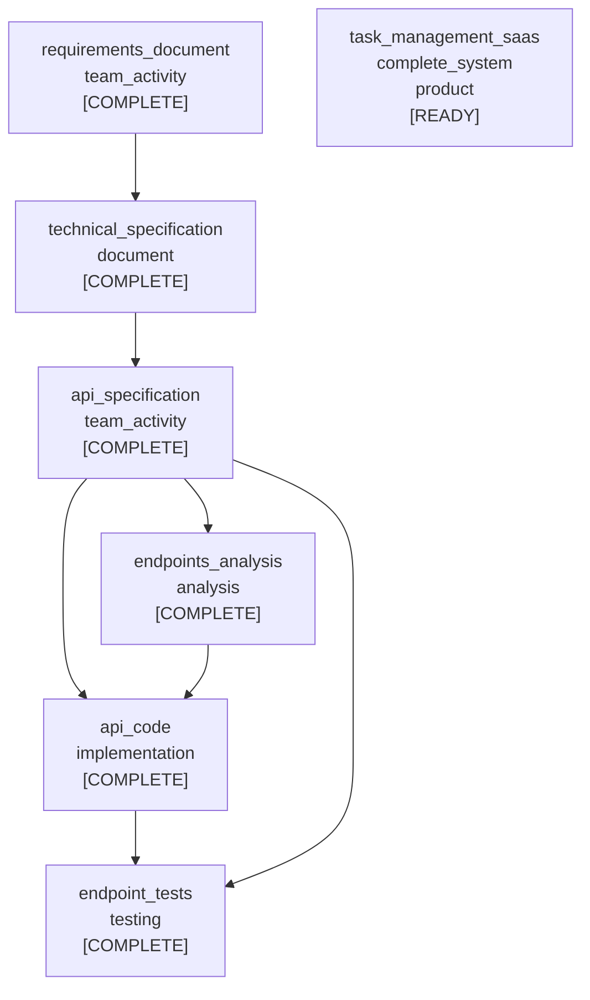
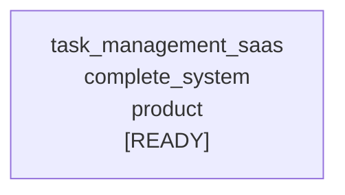

# Walkthrough smoke test (Go) — Mermaid export

- **Timestamp (UTC)**: 20251228-203323
- **Repo**: /home/manuel/workspaces/2025-12-28/port-tactician-go/tactician
- **Commit**: d4a228e764849162e2c203f754c5e1099d7a7cbb
- **Work dir**: `/tmp/tmp.zTLjtSKYNm`
- **Node count**: 7
- **Edge count**: 7

## Graph (Mermaid)

## Goals (Mermaid)

## Scenario

- init
- add root goal
- apply+complete: gather_requirements
- apply+complete: write_technical_spec
- apply+complete: design_api
- apply+complete: implement_crud_endpoints (subtasks)
